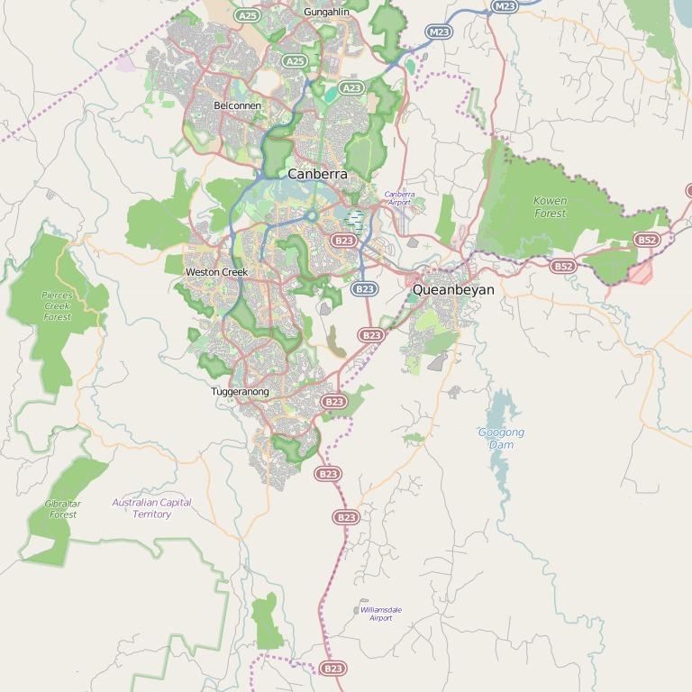

## Overview

developing a rudimentary system for
visualising traffic incidents in the Canberra region. parsing tweets from the *ACTPol_Traffic* twitter account to extract
the location (street and suburb) for incidents reported in each tweet.
then plot these locations on a map of Canberra such as the
one shown below. 

1. Unique tweet identifier
2. Date
3. Time
4. Timezone (AEST)
5. Twitter account in angled brackets

There are two versions of the map of Canberra obtained from Open Street Map,
<http://www.openstreetmap.org/export#map=12/-35.3283/149.2155>. Associated
with each map is a text file indicating the latitude and longitude range
covered by the map. The format of the lat/lon files is:

    lat_max lat_min
    lon_min lon_max

Canberra street locations were obtained via Google's geocode API. The file
format includes the query address, returned address, latitude, longitude,
location type (from Google), and number of results found. The fields are
delimited by a vertical bar.

[AHP]: http://www.anu.edu.au/students/program-administration/assessments-exams/academic-honesty-plagiarism
=======
# traffic-accident-map
>>>>>>> 71ab9c872ac45843ce8b7ae67d1e3f2b3208b940
